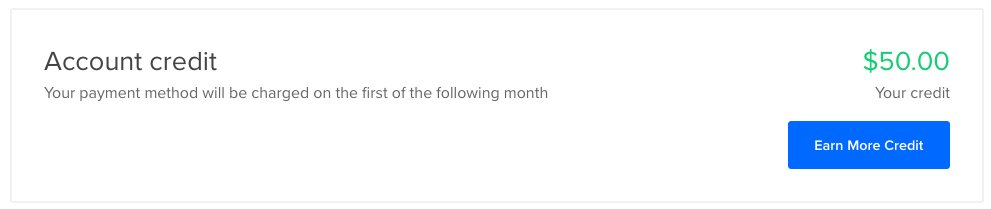
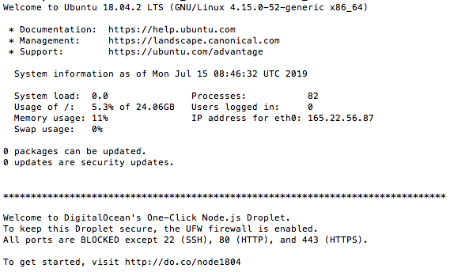

# Live Server

## Digital Ocean

Cloud Server for your app.

### Why we are doing this exercise
Computers connect to other computers on the Internet.

We want to get a computer in the cloud so that other people can connect to our special computer to see our content.

We also need to connect to our computer in the cloud to upload the content.


### Beforehand

1. Prepare a payment method - card or paypal

  (you will get free credits but the website registration will require those details)

### Obtain Remote Server

Goals:

1. Obtain Server
2. Get into Server - SSH


### 1. DigitalOcean Account, Free Credits

A. [Click here to enter DigitalOcean via this specific link](https://m.do.co/c/91c59e387330) to get the free credits for Digital Ocean for free access when you are learning NodeJS Express
```html
https://m.do.co/c/91c59e387330
```

B. Click on the Sign Up button

C. You will be brought to the next page.

Near the top, it should say:

<!--  -->


If you saw no such message, please ask someone for assistance right now:

  * Because without that message, the free credits will not come
  * Make sure you used the link above


### 2. Proceeding Into Your Email

A. Check your email

B. Click on the link inside the email

C. On the Payment Method Verification page, enter the details into the fields.

We are using the free credits. But Digital Ocean will still require those details.

- Note: See https://www.digitalocean.com/docs/accounts/billing/
  > "DigitalOcean bills in USD. To keep our pricing stable and consistent, rather than fluctuating with exchange rates, we do not bill in local currency. Similarly, we do not invoice in local currency. All invoices are in USD."
  - So it is best to use a US credit card (uses US dollars) *if you have one* - because we want to save and have less of international currency conversion fees
  - If you don't have one yet - you can follow the method below- [How to get a USD credit card when you are physically based outside of the USA](<#How-to-get-a-USD-credit-card-when-you-are-physically-based-outside-of-the-USA>)

D. Do not touch anything on this page. Do the next step now.


### 3. Free Credits!

A. [Click this link](https://cloud.digitalocean.com/account/billing) to see it!

B. It should show:

<!--  -->


### 4. Create Droplet

A. Create by using [this link - click here](https://cloud.digitalocean.com/droplets/new?appId=48826207&size=s-1vcpu-1gb)

B. Some options to set:

* Choose a datacenter region:
  - Singapore
* Authentication
  - SSH Keys `(My Best Practice)`
  - One-Time Password (Will use for just today)
* Finalize and create
  * How many Droplets?
    - 1 Droplet

<!--  -->


<!--  -->


About SSH Key: https://help.github.com/en/articles/generating-a-new-ssh-key-and-adding-it-to-the-ssh-agent


### 5. Open Details

A. See your email for the details on IP Address and Password.

eg 987.654.321.987


### 6. SSH
A. Jump onto the Command Line - the Terminal - again

B. Time to do the real SSH
```bash
#SSH
ssh root@987.654.321.987
```
After that, since we chose the Password method above, we will need to paste the password.


C. After you submit, you should see this:



### 7. This is a computer
Do some terminal commands on this computer to see how it works.


```bash
ls -la
```

```bash
curl google.com
```
```bash
ping google.com
```

```bash
touch hello.txt
```

##### Do some more terminal commands
[https://wdi-sg.github.io/gitbook-2019/01-tools/command-line/command-line-lab.html](https://wdi-sg.github.io/gitbook-2019/01-tools/command-line/command-line-lab.html)

### 8. Make a server

```bash
npm install -g http-server
```

Allow connections on that port in the droplet
```bash
sudo ufw allow 3000
```

```bash
mkdir mystuff
```

```bash
cd mystuff
```

```bash
echo "wow my name" >> myname.txt
```

```bash
http-server -p 3000
```

Check to see if you can make requests to your server

[987.654.321.987:8080/myname.txt](987.654.321.987:8080/myname.txt)

```bash
curl 987.654.321.987:8080/myname.txt
```

### 8. Final


#### Deploy Code
```bash
cd ~
git clone https://github.com/wdi-sg/express-basic.git
cd express-basic
npm install
node index.js 3000
```

#### Visit
Visit your app. (don't forget the port)

```bas
curl <IP to your droplet>
```

Visit your site in the browser. (using the IP address)

Send the address to your app to your partner in slack.

#### Further

##### permanently run your server

```
node index.js &
```
Puts the server in the background.

You can now log out of the server with exit and it stull runs: `exit`

##### Stop it

```
ps -ax | grep node
```

find the process id- the number in the far left column

```
kill -9 <process id>
```

#### Project Deployment

Take one of your unit 2 assignments. Deploy it to digital ocean.

Begin by cloning the app into your droplet like the example above.

Note: Depending on the assignment, you may need to use the terminal to **install** the postgres DB server. Refer to the installation instructions in the gitbook for linux.

